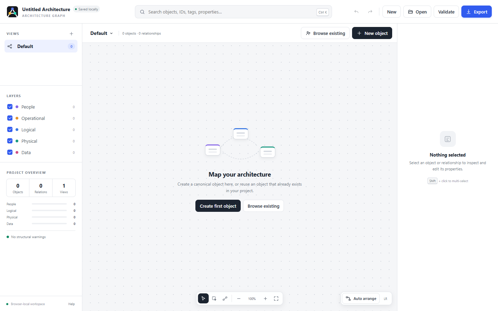

# Architecture Graph

A portable, browser-native editor for multi-layer technical dependency graphs. It keeps one canonical model of objects and relationships while allowing independent graph projections with their own membership, filters, and layout.



## Run it

Open [`portable-arch-design.html`](./portable-arch-design.html) (or [visit the github pages instance](https://jakesmo.github.io/portable-arch-design/portable-arch-design.html)) in a modern browser. The application is fully self-contained in that one HTML file: interface styling, schema/core logic, editor logic, and browser-local persistence are all embedded. No server, package install, database, runtime, or build step is required.

Browser-local work is autosaved transactionally in IndexedDB. Use **Export** to create the deterministic `<ProjectName>.arch.json` artifact intended for Git, sharing, and archival. Import it again with **Open**.

## Included in V1

- Canonical objects and typed, cross-layer relationships
- Independent per-view membership, integer coordinates, filters, and layout
- People, operational, logical, physical, and data types, plus custom types
- SVG graph editor with pan, zoom, multi-select, drag, connect, context menus, and auto-arrange
- Global object/property search and reusable object workflow
- Configurable upstream/downstream dependency traversal and saved dependency views
- Properties, tags, custom key/value metadata, relationship inspection, and view memberships
- Explicit **Remove from view** versus **Delete from model** semantics
- In-memory undo/redo and IndexedDB autosave
- Structural validation, orphan reporting, duplicate detection, and dependency-cycle analysis
- Canonical JSON serialization with stable IDs, schema ordering, sorted collections and properties, LF endings, and one final newline

## Shortcuts

| Shortcut | Action |
| --- | --- |
| `Ctrl/⌘ + K` | Global search |
| `Ctrl/⌘ + Z` | Undo |
| `Ctrl/⌘ + Shift + Z` | Redo |
| `V` | Select tool |
| `L` | Lasso multi-select tool |
| `C` | Relationship tool |
| `0` | Fit graph to screen |
| `Delete` | Remove selection from the active view |
| `Shift + Delete` | Delete selection from the canonical model |

## Files

```text
.
├── portable-arch-design.html          # complete standalone application
├── README.md
├── docs/
│   ├── architecture-graph-preview.png # README preview image
│   └── spec.md                       # architecture specification
└── tests/
    └── core.test.html               # browser core test runner
```

`portable-arch-design.html` is the only runtime application file. There are no separate CSS or JavaScript dependencies.

Open [`tests/core.test.html`](./tests/core.test.html) directly in a browser to run the core tests. The runner loads `../portable-arch-design.html?core-test=1` in a hidden frame and invokes the `ArchitectureCore` implementation embedded in the actual application. The core module is therefore defined only once: tests always exercise the production implementation rather than a copied test version.

The `core-test=1` query flag enables a small test-only message bridge and suppresses normal workspace initialization. It does not affect normal launches of `portable-arch-design.html`.

The test page reports `PASS` when deterministic export, round-trip stability, stable IDs, view independence, reference validation, conflict-marker detection, traversal, and cycle analysis succeed.
