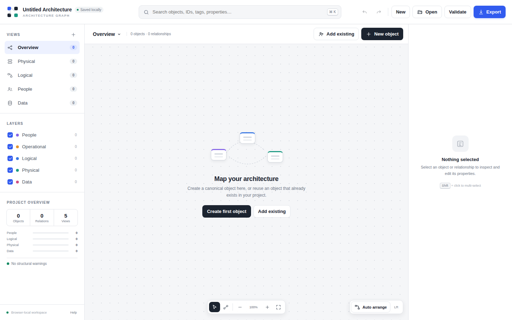

# Architecture Graph

A portable, browser-native editor for multi-layer technical dependency graphs. It keeps one canonical model of objects and relationships while allowing independent graph projections with their own membership, filters, and layout.

## Run it

Open [`ArchitectureGraph.html`](./ArchitectureGraph.html) directly in a modern browser. No server, package install, database, or build step is required.

Browser-local work is autosaved transactionally in IndexedDB. Use **Export** to create the deterministic `<ProjectName>.arch.json` artifact intended for Git, sharing, and archival. Import it again with **Open**.

## Included in V1

- Canonical objects and typed, cross-layer relationships
- Independent per-view membership, integer coordinates, filters, and layout
- People, operational, logical, physical, and data types, plus custom types
- SVG graph editor with pan, zoom, multi-select, drag, connect, context menus, and auto-arrange
- Global object/property search and reusable object workflow
- Configurable upstream/downstream dependency traversal and saved dependency views
- Properties, tags, custom key/value metadata, relationship inspection, and view memberships
- Explicit **Remove from view** versus **Delete from model** semantics
- In-memory undo/redo and IndexedDB autosave
- Structural validation, orphan reporting, duplicate detection, and dependency-cycle analysis
- Canonical JSON serialization with stable IDs, schema ordering, sorted collections and properties, LF endings, and one final newline

## Shortcuts

| Shortcut | Action |
| --- | --- |
| `Ctrl/⌘ + K` | Global search |
| `Ctrl/⌘ + Z` | Undo |
| `Ctrl/⌘ + Shift + Z` | Redo |
| `V` | Select tool |
| `L` | Lasso multi-select tool |
| `C` | Relationship tool |
| `0` | Fit graph to screen |
| `Delete` | Remove selection from the active view |
| `Shift + Delete` | Delete selection from the canonical model |

## Files

- `ArchitectureGraph.html` — static application shell
- `app.css` — interface and graph styling
- `app.js` — editor state, IndexedDB repository, interactions, and workflows
- `core.js` — independently testable schema, canonical serializer, validation, traversal, and analysis
- `tests/core.test.html` — dependency-free browser test suite

Open `tests/core.test.html` in a browser to run the core tests. The page reports `PASS` when deterministic export, round-trip stability, stable IDs, view independence, reference validation, conflict-marker detection, traversal, and cycle analysis succeed.
